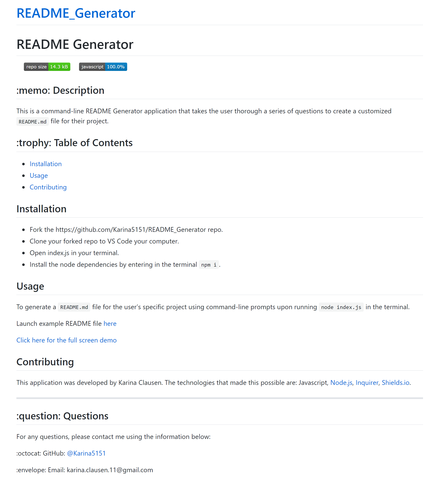

# README Generator
 &nbsp;&nbsp;&nbsp;&nbsp; &nbsp;&nbsp;&nbsp;&nbsp; &nbsp;&nbsp;&nbsp;&nbsp;
## :memo: Description
  This is a command-line README Generator application that takes the user thorough a series of questions to create a customized `README.md` file for their project. 
## :trophy: Table of Contents
* [Installation](#installation)
* [Usage](#usage)
* [Contributing](#contributing)
  
  

## Installation
* Fork the https://github.com/Karina5151/README_Generator repo. 
* Clone your forked repo to VS Code your computer. 
* Open index.js in your terminal. 
* Install the node dependencies by entering in the terminal `npm i`.

  
## Usage
To generate a `README.md` file for the user’s specific project using command-line prompts upon running `node index.js` in the terminal.

  Launch example README file [here](https://karina5151.github.io/README_Generator/)
  
  <a href="https://drive.google.com/file/d/1klP56lTJKiY6KKd6-DmZGUmv62cu7NTZ/view?usp=sharing" rel="nofollow" target="_blank">Click here for the full screen demo</a>

  
## Contributing
This application was developed by Karina Clausen. The technologies that made this possible are: Javascript, <a href="https://nodejs.org/api/fs.html" target="_blank">Node.js</a>, <a href="https://www.npmjs.com/package/inquirer" rel="nofollow" target="_blank">Inquirer</a>, <a href="https://shields.io/" rel="nofollow" target="_blank">Shields.io</a>.

 ---

## :question: Questions

For any questions, please contact me using the information below:

:octocat: GitHub: [@Karina5151](https://github.com/Karina5151)

:envelope: Email: karina.clausen.11@gmail.com
